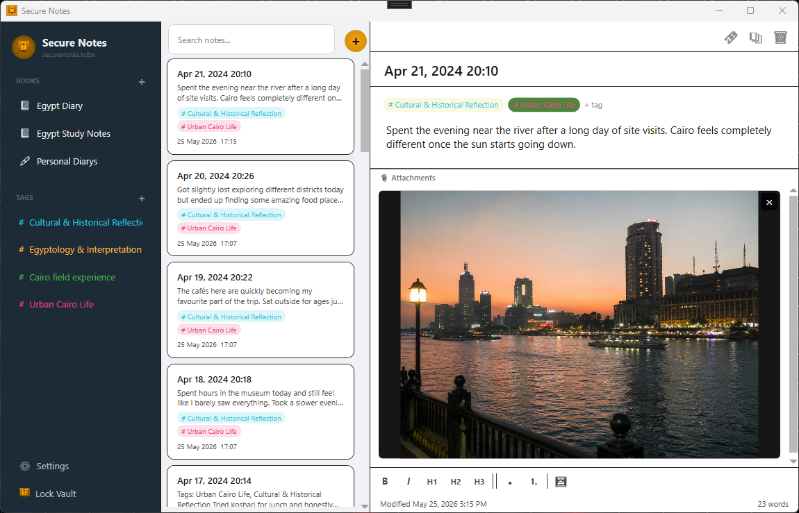
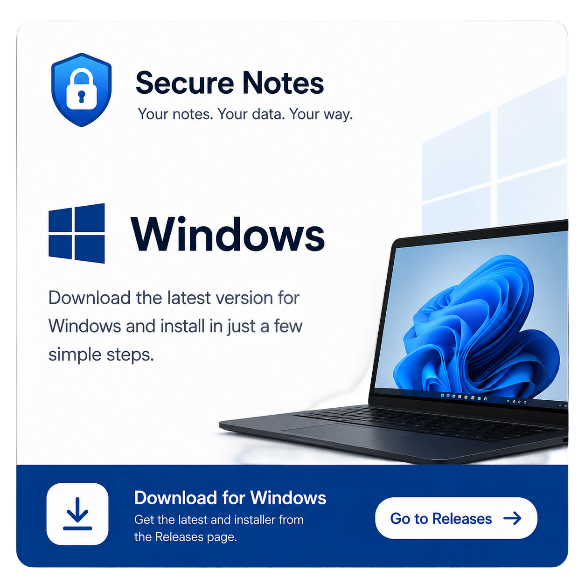
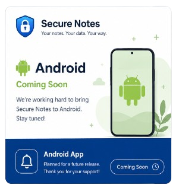
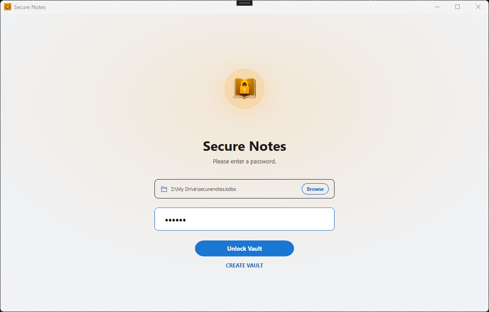
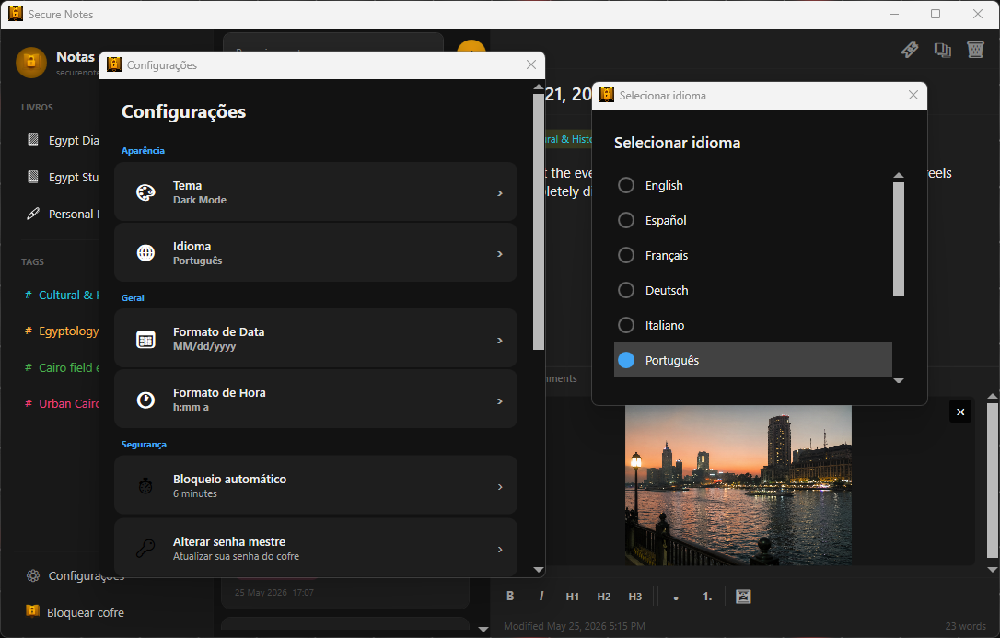
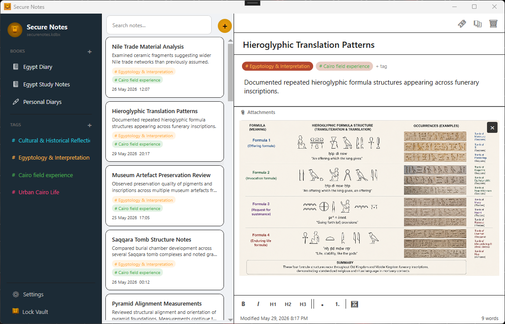
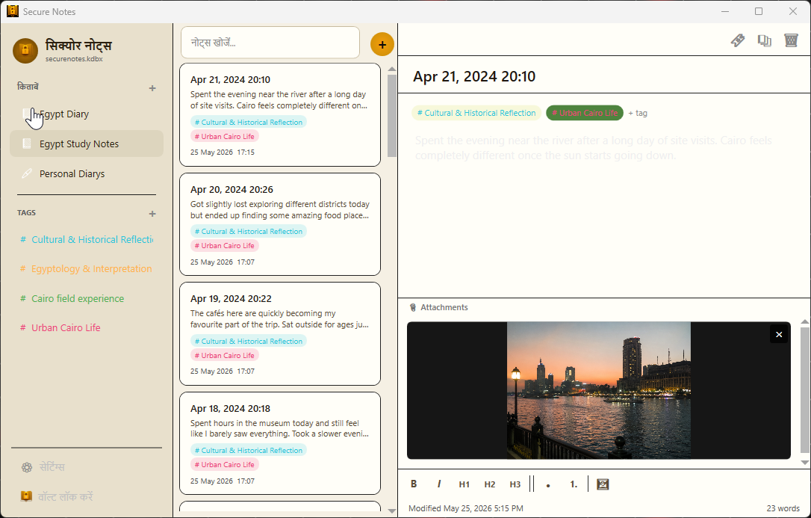
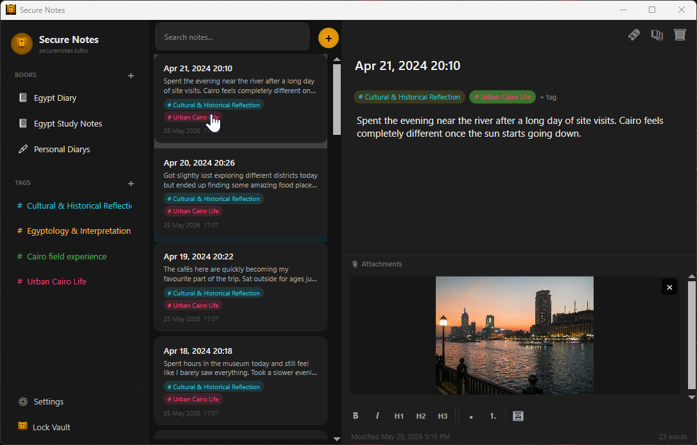

# Secure Notes for Windows

Secure Notes is a privacy-focused Windows journal and notebook application that stores your memories, notes, photos, and personal content inside a single encrypted KeePass KDBX 4.x database.

Built on open standards, Secure Notes gives you full ownership of your data. Your vault can be accessed using many compatible KeePass applications, ensuring you are never locked into a proprietary format.



## Features

### Multiple Books

Create and manage:

* Diaries
* Journals
* Notebooks

### Tags & Organisation

* Create custom tags
* Categorise entries
* Browse entries by tag

### Secure Photo Storage

Store photos directly inside your encrypted vault, attached to any new entry.

All attachments are encrypted alongside your notes and journal entries.

### Themes

Choose from four built-in themes:

* Light Mode
* Dark Mode
* Paper White
* Ink Black

### Multi-Language Support

Currently localised in 10 languages, with additional translations planned.

## Security & Privacy

Secure Notes uses modern security standards:

* AES-256 database encryption
* HMAC-SHA256 integrity protection
* Encrypted attachments and photos

Your data remains encrypted within a standard KeePass KDBX 4.x database.

## Sync & Compatibility

Your encrypted database can be stored and synchronised using services such as:

* Google Drive
* Microsoft OneDrive
* Dropbox
* Syncthing
* Network drives
* Manual file transfer

Because Secure Notes uses the standard KeePass KDBX 4.x format, your data remains portable and accessible using compatible KeePass applications.

## Import

Supported imports:

* Day One ZIP exports
* Journey ZIP exports
* Joplin Markdown + Front Matter ZIP exports
* HTML export directory

## Export

Supported exports:

* Markdown + Front Matter ZIP exports

## System Requirements

* Windows 10 or later
* 64-bit operating system

## Installation Platforms

<table>
  <tr>
    <th>Windows</th>
    <th>Android (Coming Soon)</th>
  </tr>
  <tr>
    <td align="center">
      <a href="https://github.com/dzn-tech/SecureNotesWindows/releases/download/v1.0.12/SecureNotesInstaller.msi">
        
      </a>
    </td>
    <td align="center">
      <a href="https://play.google.com/store/apps/details?id=com.securenotes.vault">
        
      </a>
    </td>
  </tr>
</table>

### Notes

- Windows version is currently available via GitHub Releases
- Android support is planned for a future release

## Building from Source

### Prerequisites

* Visual Studio 2022
* .NET 8 SDK

### Build

```powershell
dotnet restore
dotnet build -c Release
```

### Publish

```powershell
dotnet publish -c Release -r win-x64 --self-contained true
```

## Screenshots

| Lock Screen | Settings |
|------------|------------|
|  |  |

| Diary View | Notebook View |
|------------|------------|
|  |  |

| Paper White Theme | Dark Mode Theme  |
|------------|------------|
|  |  |

## Important Compatibility Notice

While Secure Notes uses the standard KeePass KDBX 4.x format, not all third-party KeePass applications fully support every feature used by Secure Notes.

If you choose to edit your database using third-party KeePass applications:

* Always keep backups
* Verify compatibility
* Exercise caution when saving changes

Improper modifications by incompatible applications may result in database corruption or data loss.

**Refrain from editing your database with third-party KeePass applications unless you fully understand what you are doing.**

## Open Source Libraries

This project uses a number of open-source libraries. See THIRD_PARTY_NOTICES.md for details.

## License

This project is licensed under the MIT License.
